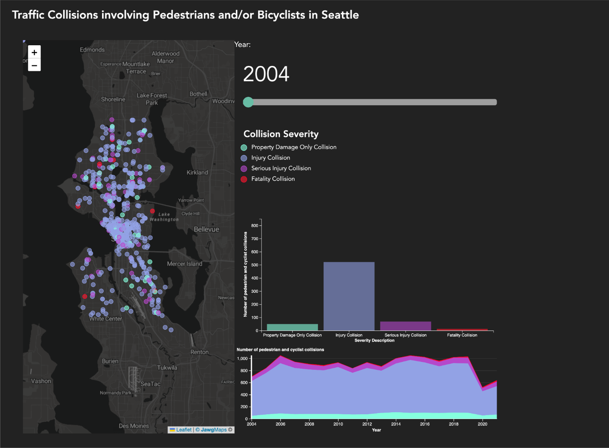

# Seattle Traffic Collision Visualization Project
This is an interactive web-based visualization tool analyzing the severity and location of pedestrian and bicyclist collisions in Seattle from 2004 to 2021, supporting the Vision Zero initiative to eliminate traffic fatalities.

Team members:
* Pahn Yenbut
* [Pu Thavikulwat](https://github.com/fudgelgentle)
* Leonardo Ochoa
* Tyler Nguyen

Originally created in Winter 2023

See the project here: https://pyenbu.github.io/seattle-collision-data-visual/ 
